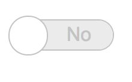

# holbertonschool-Fun-with-CSS

In this project, we experimented and implemented fun layout with HTML and CSS ONLY!

This project was completed during Full-Stack Specialisation at Holberton School.

For easier viewing, all tasks are accessible in Github Pages. You can find the link to each one below.
- [0. Sprite languages](https://judgy53.github.io/holbertonschool-Fun-with-CSS/0-index.html)
- [1. Move the (under)line](https://judgy53.github.io/holbertonschool-Fun-with-CSS/1-index.html)
- [2. Toggle](https://judgy53.github.io/holbertonschool-Fun-with-CSS/2-index.html)
- [3. Menu](https://judgy53.github.io/holbertonschool-Fun-with-CSS/3-index.html)

## 0. Sprite languages 

Without modifying [0-index.html](0-index.html) and using the image file [images\0-sprite.png](images/0-sprite.png), create `0-styles.css` and generate this layout :

## 1. Move the (under)line 

Without modifying [1-index.html](1-index.html), create `1-styles.css` and generate this layout where the underline is hidden by default and appeared slowly…:

## 2. Toggle 

Without modifying [2-index.html](2-index.html), create `2-styles.css` and generate this layout where the `<input>` is has this custom toggle layout:

**Checked:**

**Unchecked:**

## 3. Menu

Without modifying [3-index.html](3-index.html), create `3-styles.css` and generate this layout/animation:

